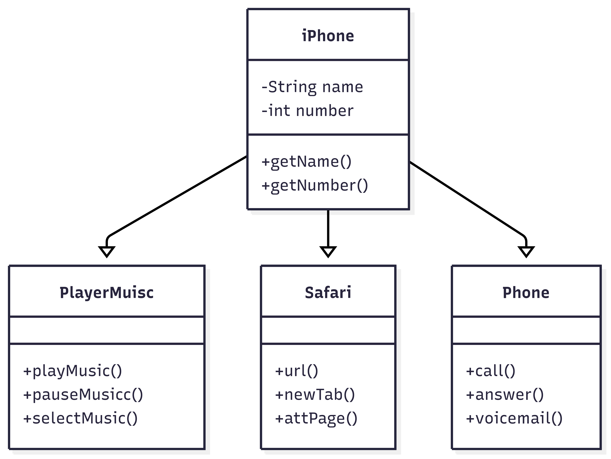

# 📱 Simulador de iPhone em Java

Este projeto é uma simulação interativa de um iPhone no terminal, desenvolvido em Java. Ele permite que o usuário interaja com funcionalidades básicas de um smartphone como reprodutor de música, telefone e navegador (Safari), tudo por linha de comando.

## 🚀 Funcionalidades

- 👤 **Cadastro do Usuário**: Solicita nome e número de telefone.
- 🎵 **Reprodutor Musical**:
  - Tocar música
  - Pausar música
  - Selecionar música
- 📞 **Telefone**:
  - Realizar ligações
  - Atender chamadas
  - Acessar correio de voz
- 🌐 **Safari (Navegador)**:
  - Acessar sites
  - Abrir nova aba
  - Recarregar página

## 📂 Estrutura do Projeto

O projeto é composto pelas seguintes classes:

- `Main.java` — Classe principal que executa o menu e faz a interação com o usuário.
- `IPhone.java` — Representa o dispositivo e armazena informações do usuário.
- `PlayerMusic.java` — Controla funcionalidades do reprodutor musical.
- `Phone.java` — Controla ações de chamadas telefônicas.
- `Safari.java` — Controla navegação via navegador simulado.

## 📊 Diagrama de Classes (UML)

O diagrama abaixo representa a estrutura de herança entre as classes do projeto:



## 💻 Tecnologias Utilizadas

- Java 17+
- `Scanner` para entrada de dados
- Tratamento de exceções com `InputMismatchException`
- Programação orientada a objetos (POO)

## 🧪 Como Executar

1. Clone o repositório:

   ```bash
   git clone https://github.com/seu-usuario/simulador-iphone.git
   cd simulador-iphone
   ```

2. Compile os arquivos:

   ```bash
   javac *.java
   ```

3. Execute o programa:

   ```bash
   java Main
   ```

## ✅ Requisitos

- JDK 17 ou superior
- Terminal ou IDE (como IntelliJ ou Eclipse)

## 📸 Demonstração

```bash
Bem-vindo ao seu Iphone!
Como gostaria de ser chamado?:
> Jefferson
Jefferson, qual é o seu número? (Apenas números)
> 123456789

Iphone de Jefferson, Número: 123456789
Escolha qual app você deseja abrir:
1 - Reprodutor Musical
2 - Telefone
3 - Navegador de Internet
4 - Desligar Aparelho
```

---

Desenvolvido por [Jefferson Andrade](https://github.com/JeffersonTadeu)
